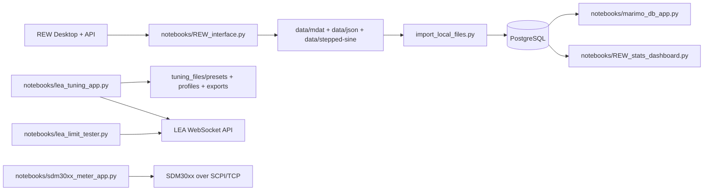

# REW Marimo Testing

End-to-end measurement automation and analysis workspace for REW, LEA amplifiers, and Postgres-backed metadata dashboards.

This repository combines:
- REW API automation for sweep capture and export
- Marimo notebook apps for operations, QA, and analysis
- PostgreSQL indexing for searchable measurement metadata
- LEA tuning profile management and command application
- Optional SDM30xx meter sampling over LAN (SCPI)

## Overview

This project is designed for hardware-facing measurement workflows where operators need to:
1. Run and export REW measurements quickly.
2. Track measurement metadata centrally in Postgres.
3. Analyze variation and tolerance bands across many captures.
4. Manage and apply LEA channel tuning profiles.

It is not a single monolithic app. It is a coordinated toolkit: core Python modules + Marimo dashboards + launcher scripts.

## Architecture



## Marimo Apps

Run all notebook apps in a dashboard:

```bash
uv run marimo run notebooks --sandbox
```

Available apps:

| File | App Title | Primary Use |
|---|---|---|
| `notebooks/REW_interface.py` | REW Sweep + Export Tool | Launch/attach REW, run sweeps, optional LEA I/O calibration, export JSON |
| `notebooks/marimo_db_app.py` | REW Metadata Dashboard | Connect to Postgres, import local/shared files, browse/filter metadata, plot JSON, delete file pointers |
| `notebooks/REW_stats_dashboard.py` | REW Statistical Analysis Dashboard | Build tolerance-band and distribution analysis from DB-linked JSON measurements |
| `notebooks/lea_tuning_app.py` | LEA Tuning Profiles | Create/edit presets and profiles, validate channel data, export/apply LEA payloads |
| `notebooks/lea_limit_tester.py` | LEA Limit Tester | Connect to LEA monitor, control signal state, log CSV, visualize live channel metrics |
| `notebooks/sdm30xx_meter_app.py` | SDM30xx Meter | Live voltage/impedance sampling from Siglent SDM30xx devices over LAN |

## Quick Start (New User)

### 1. Prerequisites

- Python 3.13+
- `uv` installed
- REW installed locally (Windows default path is used by automation)
- Optional: Docker Desktop (for local Postgres via `docker-compose.yml`)
- Optional: LEA amplifier and/or SDM30xx hardware on network

### 2. Install dependencies

```bash
uv sync
```

### 3. Configure environment

Create `.env` at repo root:

```env
LEA_IP=192.168.4.73
POSTGRES_HOST=localhost
POSTGRES_PORT=5432
POSTGRES_DB=testingdb-postgres
POSTGRES_USER=rew_app
POSTGRES_PASSWORD=change_me
REW_DATA_DIR=/absolute/path/to/rew_data
MULTIMETER_IP=192.168.1.202
```

Notes:
- `REW_DATA_DIR` is optional. If omitted or not writable, the app uses repo-local `data/`.
- For shared lab storage on Windows SMB, use a UNC path such as `\\LAB-SERVER\REW_Data`.
- `MULTIMETER_IP` is used by the SDM30xx notebook as default IP.

### 4. Start Postgres (optional but recommended for dashboard features)

```bash
docker compose up -d postgres
```

### 5. Launch the Marimo dashboard

```bash
uv run marimo run notebooks --sandbox
```

Then open notebook tiles as needed.

## How The Pieces Work Together

1. Use `REW Sweep + Export Tool` to generate measurements and export JSON/MDAT.
2. Exports are written under the active data root (`data/` by default, or `REW_DATA_DIR`).
3. Use `REW Metadata Dashboard` import action to sync and upsert measurement metadata into Postgres.
4. Use `REW Statistical Analysis Dashboard` for tolerance and distribution analysis on DB-linked JSON files.
5. Use `LEA Tuning Profiles` to manage structured tuning objects and apply validated payloads to LEA over WebSocket.
6. Use `LEA Limit Tester` and `SDM30xx Meter` for live validation and instrumentation during tuning sessions.

## Dedicated Tool Guides

## Using Marimo

### Dashboard mode (all notebooks)

```bash
uv run marimo run notebooks --sandbox
```

### Run one app directly

```bash
uv run marimo run notebooks/REW_interface.py --sandbox
```

Swap the file path for any notebook app.

### Windows launcher options

- Quick launcher: `launcher/Launch_REW_Dashboard.cmd`
- Build native launcher exe:

```powershell
powershell -ExecutionPolicy Bypass -File .\launcher\build_rew_dashboard_exe.ps1
```

This builds `launcher/dist/REW_Dashboard_Launcher.exe` and copies it to `launcher/REW_Dashboard_Launcher.exe`.

## Using REW

REW is the measurement engine. This repo uses REW's local API to automate:
- session startup/attach
- sweep commands
- measurement retrieval
- generator control
- JSON/MDAT export support

### Typical REW workflow

1. Open `REW Sweep + Export Tool`.
2. Click `Launch / Attach REW`.
3. Optionally run I/O calibration against LEA.
4. Run sweeps (SPL or stepped workflows).
5. Export selected or all measurements to JSON.
6. Save MDAT as needed.

### Important behavior in code

- `REWAutomation` attempts to attach to existing API first.
- It defaults to REW API port `4735` and probes fallback ports on macOS attach flow.
- Clear-all command handling is version-tolerant and tries multiple command labels.

## Using Postgres

Postgres stores measurement metadata and file indices for dashboard queries.

### Local service

`docker-compose.yml` includes:
- image: `postgres:16`
- container: `testingdb-postgres`
- port: `5432`
- volume: `./pgdata:/var/lib/postgresql/data`

### Import path

`import_local_files.py` performs:
- checksum-based indexing of `mdat` and `json` files
- JSON metadata parsing (UUID/title/frequency/smoothing/date stats)
- upsert into `measurement`
- upsert/update in `measurement_file`
- host tracking via `file_host`

### Expected tables

This repo assumes an existing schema with at least:
- `file_host`
- `measurement`
- `measurement_file`

`import_local_files.py` and notebook connect flows will add metric columns to `measurement` if missing, but full base schema creation is not bundled in this repo.

## Using Windows SMB For Shared Measurement Files

This project supports multi-computer collaboration by storing measurement files on a shared SMB path and indexing those files into Postgres.

Important distinction:
- SMB is used for shared file storage (`.mdat`, `.json`, etc.).
- PostgreSQL is still accessed over TCP via `POSTGRES_HOST` and `POSTGRES_PORT`.

### How this is implemented in this repo

1. `project_paths.get_data_root()` checks `REW_DATA_DIR`.
2. If `REW_DATA_DIR` is set and writable, that path becomes the active shared data root.
3. In `REW Metadata Dashboard`, `Sync and Import` performs:
   - local sync: copy local `data/` exports to shared root
   - shared import: ingest shared-root files into Postgres
4. All users pointing `REW_DATA_DIR` at the same SMB folder can read/write the same measurement pool.

### Server-side setup (one-time)

On the machine hosting shared files:

1. Create a folder for shared data, for example:
   - `D:\REW_Shared_Data`
2. Share it over SMB with a stable path, for example:
   - `\\LAB-SERVER\REW_Data`
3. Set permissions so project users can:
   - read files
   - create/update files
   - create subfolders
4. Ensure SMB is reachable on the network:
   - same LAN/VPN
   - firewall allows SMB (TCP 445) for trusted networks
5. Create or confirm folder structure:
   - `mdat`
   - `json`
   - `txt`
   - `stepped-sine`

### New user setup (Windows)

1. Connect to the SMB share in File Explorer:
   - enter `\\LAB-SERVER\REW_Data` in the address bar
2. Authenticate with credentials that have write access.
3. Optional: map a persistent drive letter:

```powershell
net use R: \\LAB-SERVER\REW_Data /persistent:yes
```

4. In this repo's `.env`, set:

```env
REW_DATA_DIR=\\LAB-SERVER\REW_Data
POSTGRES_HOST=LAB-SERVER
POSTGRES_PORT=5432
POSTGRES_DB=testingdb-postgres
POSTGRES_USER=rew_app
POSTGRES_PASSWORD=change_me
```

5. Launch the dashboard:

```bash
uv run marimo run notebooks --sandbox
```

6. Open `REW Metadata Dashboard` and click `Sync and Import`.

### Quick connection checks

From PowerShell:

```powershell
Test-Path "\\LAB-SERVER\REW_Data"
```

If that returns `True`, SMB path access is working for this user session.

### Recommended team workflow

1. Export measurements from `REW Sweep + Export Tool`.
2. Run `Sync and Import` in `REW Metadata Dashboard`.
3. Analyze datasets from `REW Statistical Analysis Dashboard`.

This keeps file storage centralized via SMB and metadata searchable via Postgres.

## Project Layout

```text
notebooks/                Marimo app entrypoints
launcher/                 Windows/macOS/Linux launch/build wrappers
data/                     Local measurement data root (gitignored)
pgdata/                   Docker Postgres data (gitignored)
tuning_files/             Presets/profiles/exports and imported tuning content
REWAutomation.py          REW API client
REW_measurements.py       Measurement flow orchestration
LEA_controls.py           LEA WebSocket payload + command helpers
data_handling.py          Decode, transform, pass/fail, and JSON export helpers
import_local_files.py     File ingestion and Postgres upsert workflow
project_paths.py          Repo/data/tuning path and .env resolution
tuning_storage.py         Preset/profile validation + file persistence
SDM30xx_SCPI.py           SDM TCP/SCPI client
auto_tuning.py            Placeholder auto-tune suggestion API
```

## Data And Paths

Path resolution is centralized in `project_paths.py`.

Data directories:
- `get_mdat_dir()` -> `<data_root>/mdat`
- `get_json_dir()` -> `<data_root>/json`
- `get_txt_dir()` -> `<data_root>/txt`
- `get_stepped_sine_dir()` -> `<data_root>/stepped-sine`

Tuning directories:
- `tuning_files/presets`
- `tuning_files/profiles`
- `tuning_files/exports`

## Program And Function Reference

This section summarizes the major programs and callable functions in the repository.

### `REWAutomation.py`

- Class: `REWAutomation`
- Lifecycle/session:
  - `__init__`
  - `is_server_setup`
  - `_api_is_up`
  - `_detect_running_api_port`
  - `_is_rew_process_running`
- Generic HTTP helpers:
  - `get_request`
  - `post_request`
  - `_parse_api_response`
- REW read APIs:
  - `get_application_commands`
  - `get_measurements`
  - `get_measurements_id`
  - `get_measurements_id_freq_response`
  - `get_measurements_frequency_response_smoothing_choices`
  - `get_measurements_distortion`
  - `get_stepped_sine_progress`
  - `get_last_input`
- REW load/save/session commands:
  - `load_mdat`
  - `save_mdat`
  - `post_measurements_command_saveall`
  - `post_measurements_command_clearall`
  - `post_command_shutdown`
- Sweep/audio configuration:
  - `post_measure_sweep_config`
  - `post_measure_naming`
  - `post_measure_command`
  - `post_audio_driver`
  - `post_audio_device`
  - `post_audio_asio_input`
  - `post_audio_asio_output`
  - `post_no_overall_average`
- Stepped measurement configuration:
  - `post_stepped_measurement`
  - `post_stepped_measurement_FFT_configuration`
  - `post_stepped_measurement_frequency_span`
  - `post_stepped_measurement_options`
  - `post_stepped_measurement_type`
- Generator controls:
  - `post_generator_configuration`
  - `post_generator_command`
  - `start_generator_tone`
  - `stop_generator_tone`

### `REW_measurements.py`

- Class: `Measurements`
- Functions:
  - `__init__`
  - `sine_sweep`
  - `stepped_sine_sweep`
  - `save_measurements_mdat`
  - `save_measurements_json`
  - `shutdown_REW`
  - `calculations_sine`
  - `calculations_stepped_sine`
  - `unit_selection`
  - `unitInput`
  - `REW_IO_Calibration`

### `LEA_controls.py`

- Class: `Lea_Settings`
- Payload/build helpers:
  - `build_set_command`
  - `send_command`
  - `send_batch`
  - `websocket_connect`
- Device/channel queries:
  - `amp_deviceInfo`
  - `channel_levels_get`
  - `channel_output_get`
  - `return_amp_name`
  - `get_rms_limiter_value`
  - `get_measured_output_voltage`
- Channel write helpers:
  - `set_channel_gain`
  - `set_channel_delay`
  - `set_channel_polarity`
  - `set_channel_peq`
  - `set_channel_crossover`
  - `set_channel_limiter`
  - `set_channel_routing`
  - `set_channel_mute`
- Legacy/simple helpers:
  - `mute`
  - `unmute`
  - `crossover`
  - `volume`

### `data_handling.py`

- Class: `Data_Handling`
- Decode/transforms:
  - `sanitize_filename`
  - `decode_array`
  - `byte_to_float_array`
  - `build_freq_array_from_response`
- JSON loading and comparisons:
  - `load_json_column`
  - `load_json_freq`
  - `list_dev_calc`
  - `list_abs_value`
  - `unit_pass_fail`
  - `stepped_sine_pass_fail`
- Benchmark/unit utilities:
  - `get_bmark`
  - `get_unit_type`
- JSON writers:
  - `make_json`
  - `make_stepped_json`
  - `make_marimo_json`
- Legacy methods retained for compatibility:
  - `get_measure_sweep_configuration`
  - `get_measure_commands`
  - `get_input_levels_commands`

### `import_local_files.py`

- Connection and lookup:
  - `get_db_conn`
  - `ensure_host`
  - `file_already_indexed`
  - `file_by_path`
- File utilities:
  - `iter_files`
  - `sha256_file`
  - `parse_timestamp`
  - `parse_measurement_json`
- Main workflow:
  - `import_files`
  - `main`

### `project_paths.py`

- Environment/path resolution:
  - `_load_dotenv`
  - `get_repo_root`
  - `_can_write_root`
  - `get_data_root`
- Data path helpers:
  - `get_mdat_dir`
  - `get_json_dir`
  - `get_txt_dir`
  - `get_stepped_sine_dir`
- Tuning path helpers:
  - `get_tuning_root`
  - `get_tuning_presets_dir`
  - `get_tuning_profiles_dir`
  - `get_tuning_exports_dir`
- Directory creation:
  - `ensure_data_dirs`
  - `ensure_tuning_dirs`

### `tuning_storage.py`

- Defaults/constants:
  - `SCHEMA_VERSION`
  - `DEFAULT_CHANNELS`
- Internal helpers:
  - `_new_channel`
  - `_now_iso`
  - `_index_path`
  - `_item_path`
  - `_load_json`
  - `_save_json`
  - `_coerce_channels`
  - `_validate_channels`
  - `_update_index`
- Public API:
  - `load_index`
  - `save_index`
  - `list_presets`
  - `list_profiles`
  - `validate_preset`
  - `validate_profile`
  - `load_preset`
  - `load_profile`
  - `save_preset`
  - `save_profile`

### `import_embodied_tunings.py`

- Source import helpers:
  - `_is_ignored`
  - `_read_json`
  - `_split_hi_lo`
  - `_as_channel`
- Runner:
  - `main`

### `SDM30xx_SCPI.py`

- Class: `SDM30xx_SCPI`
- Methods:
  - `__init__`
  - `send_command`
  - `read_response`
  - `qeury_command`
  - `close`
  - `query_impedance`
- Script runner:
  - `main`

### `auto_tuning.py`

- `suggest_adjustments(measurement, target_curve)`  
  Placeholder API for future automated tuning suggestions.

### `launcher/launch_rew_dashboard.py`

- `_venv_paths`
- `_find_repo_dir`
- `_pick_command`
- `_write_debug_log`
- `_pause_on_failure`
- `main`

### `launcher/build_rew_dashboard.py`

- `_project_root`
- `_artifact_name`
- `_build_command`
- `main`

### Notebook-local named helpers

Most Marimo cells are generated as `def _(...):` blocks. The notebooks also define named helpers where needed:

- `notebooks/lea_tuning_app.py`
  - `new_preset_template`
  - `new_profile_template`
  - `parse_json_field`
  - `build_channels_from_ui`
  - `build_lea_payloads`
- `notebooks/lea_limit_tester.py`
  - `lt_run_loop`
  - `lt_create_event_loop`
  - `lt_submit`
- `notebooks/sdm30xx_meter_app.py`
  - `sdm_safe_float`
  - `sdm_query_measurement`
  - `sdm_close_client`
  - `sdm_test_connection`

### Legacy utility scripts

- `txt-data-formatter.py`
  - `get_folder_size`
  - `strip_file`
  - `get_all_raw_file_names`
  - `strip_raw_file`
  - `get_raw_folders`

## Operational Notes

- `main.py` is intentionally empty and not used as an entrypoint.
- `data/`, `pgdata/`, launcher build artifacts, and cache directories are gitignored.
- `notebooks/__marimo__/` is generated runtime state and should not be committed.

## Typical Daily Commands

Install/update dependencies:

```bash
uv sync
```

Run all notebook apps:

```bash
uv run marimo run notebooks --sandbox
```

Import local/shared files into Postgres from CLI:

```bash
uv run python import_local_files.py
```

Build native launcher:

```bash
uv run python launcher/build_rew_dashboard.py
```
